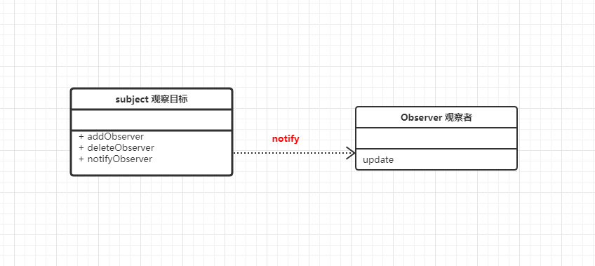

响应式系统是vue的一个独特特性。它通过无法shim的ES5对象描述符中的getter和setter来实现观察者模式。在getter中添加观察者，并且在setter中通知观察者执行变化。

标准的观察者模式如下：


在vue实例的初始化过程中，将会为data的每一个属性视为观察目标，并且为每一个属性维护一个deps数组，用来收集这个属性的watcher
```javascript
export function defineReactive(ob, key, val){
  // 执行观察
  let childObserve = observe(val),
    dep = new Dep()
  Object.defineProperty(ob, key, {
    configurable: true,
    enumerable: true,
    get: () => {
      if(Dep.target){
        // 依赖收集
        // Dep.target 是一个watcher
        dep.addDep(Dep.target)
      }
      return val 
    },
    set: newVal => {
      if(newVal === val) return 
      val = newVal 
      // 如果新赋值的是个object
      childObserve = observe(val)
      dep.notify()
    }
  })
}
```

当设置data属性的时候，就会触发dep的notify方法，依次调用watcher的回调函数

```bash
npm run test // 执行测试
```
